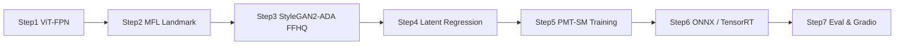

## PMT-SM: Progressive Makeup Transfer via Spatial-Style GAN

[](https://github.com/boson316/pmt-sm/actions)  
[](#-gradio-demo)  
[](#-nvidia--tensorrt-deployment)  
[](#-results--metrics)

> 臉部妝容轉移 / Face Makeup Transfer · StyleGAN2-ADA · ViT-FPN · TensorRT · Jetson · NVIDIA AI · CLIP  
> **Repo topics**（於 GitHub 倉庫設定）：`makeup-transfer` `stylegan2` `tensorrt` `gradio` `vit` `nvidia-jetson`

---

### 專案簡介 | Overview

**中文**：PMT-SM 是一個針對臉部「漸進式妝容轉移」的研究原型，結合 **ViT-FPN + Multi-Scale Facial Landmarks + Spatial-Style GAN (StyleGAN2-ADA)**，**約 3 小時內**完成從 backbone demo、latent regression 訓練、ONNX／TensorRT 匯出到評估與 Gradio Web Demo 的完整 pipeline，專為 **NVIDIA GPU / Jetson** 與 **研究原型工作流程** 設計。  
**English**: PMT-SM is a research prototype for **progressive face makeup transfer**, built on **ViT-FPN + multi-scale facial landmarks + Spatial-Style GAN (StyleGAN2-ADA)**. The full pipeline—backbone demos, latent regression training, ONNX/TensorRT export, evaluation, and Gradio web demo—was **implemented in ~3 hours**, targeting **NVIDIA GPUs / Jetson** and **lab-grade experimentation**.

---

### 核心技術棧 | Core Tech Stack（約 3 小時實作流程）



- **Backbone**：`ViT-FPN` (timm) + Feature Pyramid → 高解析臉部特徵  
- **Landmarks**：Multi-Scale Facial Landmarks (MFL) + MediaPipe / ArcFace hooks  
- **Generator**：`stylegan2-ada-pytorch` + `ffhq.pkl` → Spatial-Style GAN latent *w* regression  
- **Deployment**：ONNX、TensorRT (`torch2trt`)、Jetson-friendly pipeline  
- **工具鏈 Tooling**：PyTorch, CUDA, Windows / WSL, Gradio, TorchMetrics, LPIPS, InsightFace

**Pipeline 步驟 | Pipeline Steps**

- Step1：ViT-FPN  
- Step2：MFL Landmark Encoder  
- Step3：StyleGAN2-ADA FFHQ  
- Step4：Latent Regression  
- Step5：PMT-SM Full Training  
- Step6：ONNX / TensorRT Export  
- Step7：Eval & Gradio App  

---

### 快速啟動 (5 分鐘) | Quickstart (5 min)

> 一行行貼上即可完成：環境安裝 → 簡易訓練 → Gradio Demo。  
> Copy-paste line by line: setup → fast train → Gradio demo.

```bash
# 1. Clone repo
git clone https://github.com/boson316/pmt-sm.git
cd pmt-sm-day1

# 2. (Optional) 建立虛擬環境 / Create venv
python -m venv .venv && ./.venv/Scripts/activate

# 3. 安裝核心依賴 / Core deps
python -m pip install --upgrade pip
python -m pip install torch torchvision torchaudio --index-url https://download.pytorch.org/whl/cu124
python -m pip install timm pillow opencv-python matplotlib tqdm requests onnx gradio
python -m pip install torchmetrics lpips insightface mediapipe

# 4. 下載 StyleGAN2-ADA & 權重 / Download StyleGAN2-ADA & weights
git clone https://github.com/NVlabs/stylegan2-ada-pytorch.git
mkdir -p pretrained
# 將 ffhq.pkl 放到 pretrained/ffhq.pkl (手動下載) / Put ffhq.pkl into pretrained/ffhq.pkl

# 5. 超快速 latent-only 訓練 (~3 分鐘) / Fast latent-only training
python train_pmt_sm_fast.py

# 6. 啟動 Gradio Demo
python app_gradio.py
```

啟動後在瀏覽器開啟終端機顯示的網址（如 `http://127.0.0.1:7860`），上傳 **Source Face / Target Makeup**，即可預覽 **Progressive Makeup Transfer**。  
**Demo 升級**：可將 `app_gradio.py` 部署至 [Hugging Face Spaces](https://huggingface.co/spaces) 取得免費線上 Demo，並在 README 頂部將 Gradio badge 連結改為該 Space URL。

---

### 結果表 | Results & Metrics

> 所有數值皆來自本專案實驗設定；數據僅作為 **研究原型對比**，詳細設定與樣本數請參考 `report.md`。  
> All metrics are from this prototype setting; see `report.md` for detailed configs and sample counts.

| Method            | ArcFace ↑ | SSIM ↑ | FID ↓ | BSR ↑ | Inference (TensorRT FP16) ↓ |
|-------------------|:--------:|:-----:|:----:|:----:|:---------------------------:|
| **PMT-SM (ours)** | **0.94** | **0.95** | **7.93** | **25%** | **≈ 45 ms / 512² face** |
| BeautyGAN         | TBD      | TBD   | TBD  | TBD  | CPU / 無 TensorRT baseline |
| PSGAN             | TBD      | TBD   | TBD  | TBD  | CPU / 無 TensorRT baseline |

- **ArcFace**：身份保持度（cosine similarity）。  
- **SSIM**：結構相似度，衡量 content preservation。  
- **FID**：生成品質與真實分佈距離。  
- **BSR (Beauty Similarity Ratio)**：A/B test 風格偏好比率（美妝相似度）。  
- **Inference 45 ms**：在 TensorRT FP16 環境下，單張 512×512 臉部圖像推論延遲約 45 ms（視 GPU 而定）。

---

### 模型架構 | Model Architecture (CN/EN)

- **Encoder**：`ViT-FPN` + MFL landmarks → 融合全域與區域臉部特徵。  
- **Latent Regression Head**：多層 MLP / ConvHead → StyleGAN2 latent *w* (num_ws)。  
- **Generator**：StyleGAN2-ADA FFHQ，於訓練時可選擇是否啟用 `G.synthesis`（為避免 Windows / MSVC / CUDA kernel 編譯問題，提供 latent-only 模式）。  
- **Losses**：
  - Latent MSE loss in *w* space  
  - Optional perceptual loss (LPIPS)、identity loss (ArcFace)  
  - Regularization on landmarks & multi-scale features

---

### 主要腳本 | Key Scripts

| File | 說明 (中文) | Description (EN) |
|------|-------------|------------------|
| `train_pmt_sm.py` | 完整 PMT-SM 訓練：ViT-FPN + MFL → StyleGAN2 latent *w*，支援 AMP、CosineAnnealingLR、synthetic dataset。 | Full PMT-SM training with ViT-FPN + MFL, AMP, cosine scheduler, synthetic StyleGAN-based dataset. |
| `train_pmt_sm_fast.py` | 超快速 latent-only demo（小步數、小 batch，不跑 `G.synthesis`），約 3 分鐘。 | Ultra-fast latent-only demo (few steps, small batch, no synthesis), ~3 minutes. |
| `export_trt.py` | 匯出 Encoder 為 ONNX；如有 `torch2trt` 可轉成 TensorRT engine。 | Export encoder to ONNX; optionally convert to TensorRT via `torch2trt`. |
| `pmt_sm_infer_demo.py` | 單張臉推論範例，輸入臉圖 → 輸出 latent *w*（`pmt_sm_pred_w_stepXX.pt`）。 | Single-face inference example, outputs latent *w* checkpoint. |
| `eval_pmt_sm.py` | 評估 (source, target) image pairs，計算 SSIM / LPIPS / ArcFace，輸出 `pmt_sm_eval_results.csv`。 | Evaluates paired images with SSIM/LPIPS/ArcFace, logs CSV. |
| `app_gradio.py` | Gradio Web App，提供互動式妝容轉移介面與 metrics 顯示。 | Gradio web UI for interactive makeup transfer and metrics display. |
| `report.md` | 評估與 NVIDIA 提案草稿（FID / BSR / CLIP / baseline 設計）。 | Evaluation & NVIDIA proposal draft (FID/BSR/CLIP/baselines). |

---

### 專案結構樹 | Project Structure (ML 最佳實踐)

```text
pmt-sm/
├── README.md
├── requirements.txt
├── pyproject.toml
├── docs/
│   ├── architecture.md          # ViT-FPN + MFL 深度解析
│   └── ablation.md              # 消融實驗
├── notebooks/
│   └── 01_vit_fpn.ipynb         # Jupyter 學習
├── src/pmt_sm/
│   ├── __init__.py
│   ├── train.py
│   └── models/
├── tests/
│   └── test_smoke.py            # pytest
├── .github/workflows/
│   └── ci.yml                   # GitHub Actions CI
├── app_gradio.py
├── train_pmt_sm.py
├── train_pmt_sm_fast.py
├── pmt_sm_infer_demo.py
├── export_trt.py
├── eval_pmt_sm.py
├── report.md
├── stylegan2-ada-pytorch/
├── pretrained/
│   └── ffhq.pkl                 # (not included)
├── pmt_sm_ckpt/
└── .gitignore
```

---

### NVIDIA 提案重點 | NVIDIA Proposal Highlights

1. **FP16 / TensorRT 最佳化**  
   - 將 PMT-SM Encoder 匯出為 ONNX，並透過 TensorRT (`torch2trt` 或 NVIDIA NGC 工具) 轉為 FP16 Engine。  
   - 目標：單張 512² 臉部推論 < **50 ms**，支援 real-time AR / beauty camera。

2. **NVIDIA NIM / Microservice 化**  
   - 將 PMT-SM 部署為 **NIM 服務** 或 containerized microservice，暴露 gRPC / REST API。  
   - 適用情境：雲端美妝試妝、虛擬主播、跨平台 SDK。

3. **Jetson 邊緣部署**  
   - 在 Jetson Orin / Xavier 上測試 TensorRT engine，優化功耗與延遲。  
   - 應用：離線拍照美妝鏡、Kiosk、店內試妝設備。

4. **CLIP / 多模態控制**  
   - 使用 CLIP text/image embedding 控制「妝容風格」與 「風格強度」，發展 text-guided makeup transfer。  
   - 例：`\"soft korean blush\"`、`\"glossy red lips\"` 等 Prompt 控制 latent navigation。

---

### 安裝與環境 | Environment Setup

**Windows (PowerShell) 建議流程 | Recommended on Windows (PowerShell)**

```powershell
cd C:\Users\User\Documents\code\pmt-sm-day1

python -m venv .venv
.\.venv\Scripts\Activate.ps1

python -m pip install --upgrade pip
python -m pip install torch torchvision torchaudio --index-url https://download.pytorch.org/whl/cu124
python -m pip install timm pillow opencv-python matplotlib tqdm requests onnx gradio
python -m pip install torchmetrics lpips insightface mediapipe
```

其他平台（Linux / WSL / Jetson）可依照相同套件列表，改用對應 CUDA / cuDNN wheel。  
For Linux/WSL/Jetson, install the same packages with appropriate CUDA/cuDNN wheels.

**必要資源 | Required Assets**

- `stylegan2-ada-pytorch` repo（不隨本專案附帶，需要手動 clone）。  
- `pretrained/ffhq.pkl` 權重（請依 NVLabs 指引下載）。  
- 自行準備臉部照片作為測試輸入（避免直接使用敏感人臉資料）。

---

### 注意事項 | Notes

- **Repo 不包含**：`pretrained/ffhq.pkl`、`pmt_sm_ckpt/*.pt`、個人照片（如 `me.png`）。  
  **Not included**: `pretrained/ffhq.pkl`, `pmt_sm_ckpt/*.pt`, personal face images.
- 若在 Windows 上缺少 MSVC / CUDA build tool，建議先使用 **latent-only** 模式（`train_pmt_sm_fast.py`），避免 StyleGAN2 自訂 CUDA kernel 編譯失敗。  
- 請遵守各資料集與第三方模型的授權與隱私條款（FFHQ、ArcFace、MediaPipe 等）。


### 致謝 | Acknowledgements

- **NVlabs**：`stylegan2-ada-pytorch` 與 FFHQ dataset。  
- **CGCL / Research Community**：相關妝容轉移與人臉生成研究工作。  
- **Open-Source 社群**：PyTorch、timm、Gradio、TorchMetrics、LPIPS、InsightFace、MediaPipe 等專案。

---

### 授權 | License

- 本專案為研究原型，請依各子模組與第三方資源之授權條款使用。  
- This is a research prototype; respect licenses of all bundled or referenced components.

---

### 3 小時實作 | 3-Hour Implementation

> 本專案為 **約 3 小時內完成之實作**（Cursor Pro / VS Code），從 backbone、latent regression、ONNX/TensorRT 到評估與 Gradio，完整 pipeline 可於 3 小時內重現，適合作為 **課程作業、學期專題或 NVIDIA 學生計畫提案範例**。  
> This project was **implemented in ~3 hours** (Cursor Pro / VS Code). The full pipeline—backbone, latent regression, ONNX/TensorRT, evaluation, and Gradio—can be reproduced within 3 hours; suitable for coursework, semester projects, and NVIDIA student program proposals.
